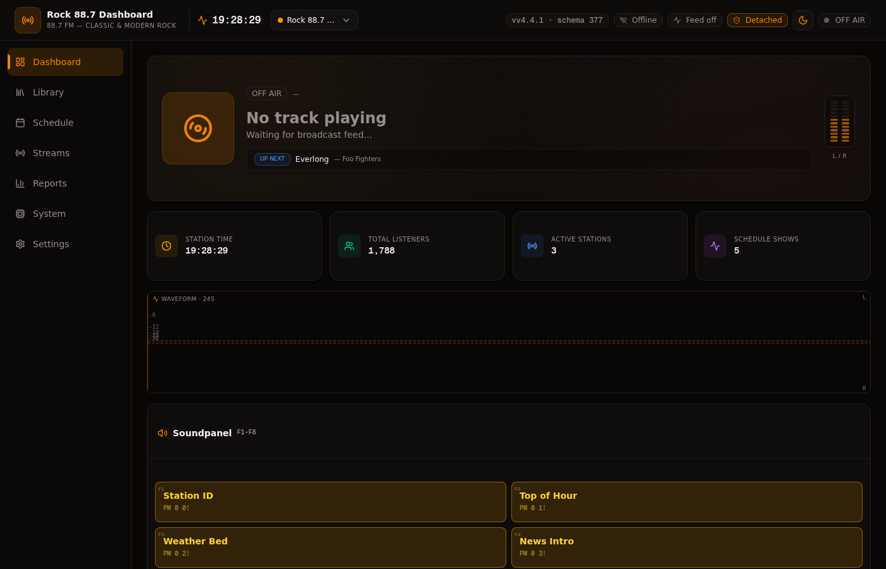
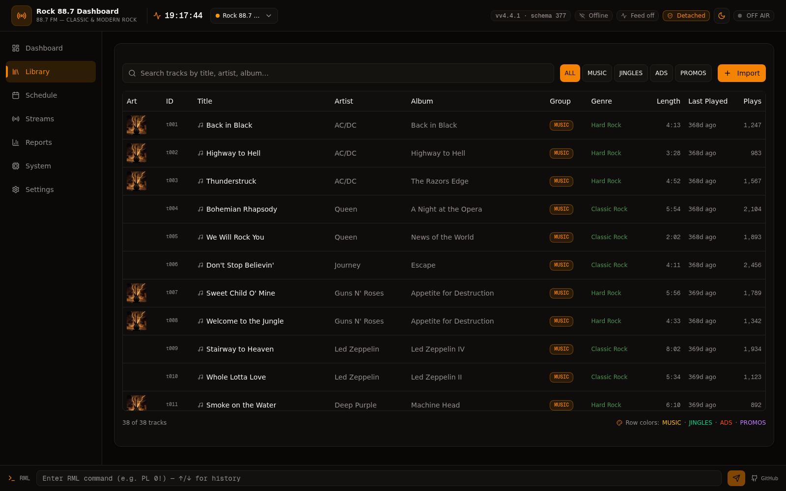
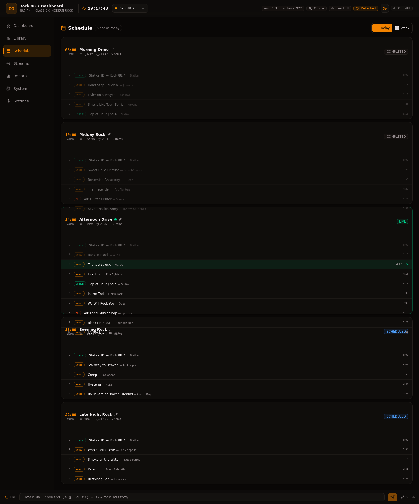
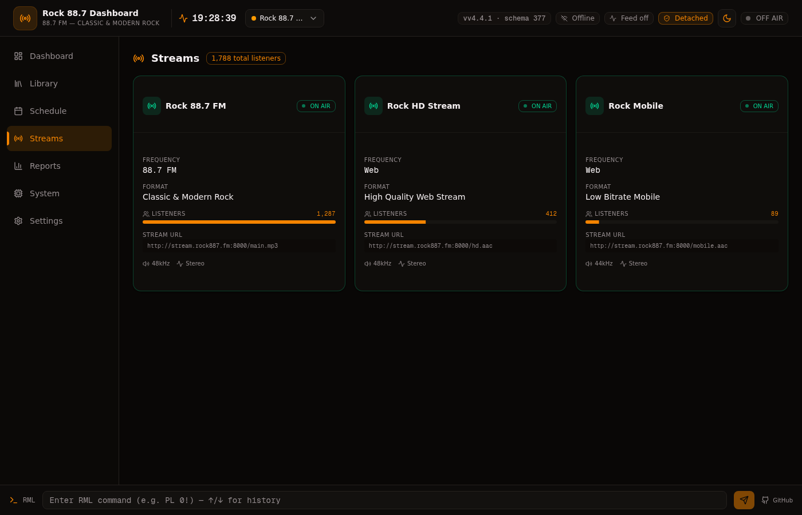
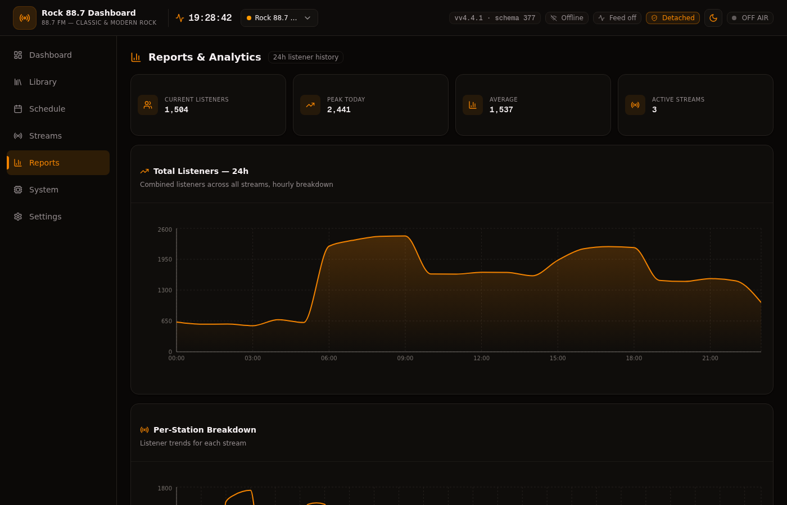
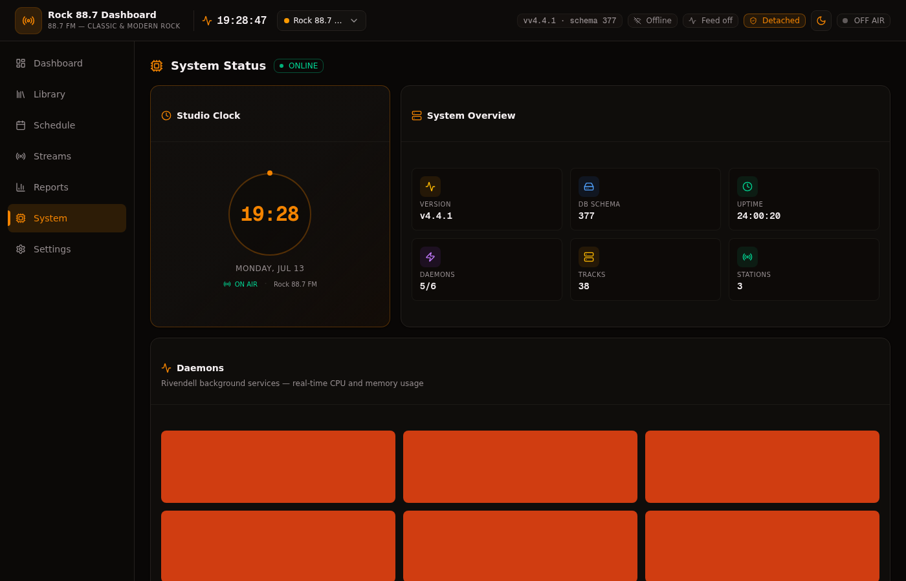

# Rock 88.7 — Broadcast Control Center

> *An AI operating system for a radio station — built to earn trust, not demand it.*

Open-source AI-powered radio broadcast automation platform for the [Rivendell Radio Automation System](https://github.com/ElvishArtisan/rivendell). Clean-room implementation inspired by AzuraCast (MIT), LibreTime (AGPL), and RCS Zetta (commercial UI concepts only).

---



---

## What this is

Rock 88.7 is not just a radio dashboard with an AI bolted on. It is a system designed to answer one question honestly:

> **"After three years of operation, why should a human trust this AI?"**

Most AI systems report confidence. Almost none verify it. This project's distinguishing feature is not what the AI *can* do — it is the **epistemological layer** that decides what the AI is *allowed* to do, based on accumulated evidence.

### The five layers

```
Broadcast Platform          (Sprints 1–10)
       ↓
AI Operating System         (Sprints 11–20)
       ↓
AI Core + Memory            (Sprints 21–29)
       ↓
Epistemic Layer             (Sprints 31–33)
  7 invariants, 3 enforcement mechanisms
       ↓
Governance Layer            (Sprints 31–31b)
  Decision Ledger, Calibration, Autonomy Ladder, Trust Score
       ↓
Real Station Experience     ← awaiting
```

---

## CI/CD Quality Badges


---

## Screenshots

### Dashboard — Now Playing hero, real-time waveform, soundpanel, listener requests


### Library — 38 real rock tracks with AI-generated album art, search, group filter


### Schedule — Today's shows, weekly timetable, drag-drop log editor, AI Voice Track generator


### Streams — 3 stations with real-time WebSocket listener stats


### Reports — 24h listener analytics with daypart patterns


### System — Studio clock, daemons, RDS, SNMP, GPIO, AI Trust Center (governance dashboard)


---

## The AI Trust Center

The System tab contains the **AI Trust Center** — the answer to "why should a human trust this AI?" displayed as a single panel. Every number is computed from real data in the Decision Ledger and the listener pipeline. With zero real data, every field is `0 / null / insufficient-data`, and that is shown honestly.

### Trust Score (6 weighted components)

| Component | Weight | What it measures |
|-----------|--------|------------------|
| Real data existence | 0.25 | Without real data, nothing else matters |
| Confidence calibration | 0.20 | Is the AI's confidence honest? (10-bucket calibration) |
| Human acceptance rate | 0.15 | Do humans actually accept the AI's recommendations? |
| Prediction accuracy | 0.15 | Is the AI right? (mean absolute prediction error) |
| Temporal stability | 0.15 | Has the AI's knowledge held over time? (4 tiers) |
| Epistemic cleanliness | 0.10 | Does the system obey its own rules? (invariant violations) |

The score is not a feeling — it is a weighted sum. With 0 real data, it is 0/100. That is the correct starting state.

### Autonomy Ladder (5 levels)

The AI starts at **Level 0 — Observe only**. It cannot suggest, let alone act. Each promotion requires hard evidence:

| Level | Label | Requirements |
|-------|-------|--------------|
| 0 | Observe only | (default) |
| 1 | Suggest | 50+ observed decisions |
| 2 | Human approval | 500+ decisions, <15% error, >70% acceptance, no violations |
| 3 | Automatic overnight | 1000+ decisions, <10% error, >80% acceptance, 90 violation-free days |
| 4 | Full autonomous | 5000+ decisions, <7% error, >85% acceptance, 180 violation-free days |

**Promotions are never automatic.** A human must approve each one.
**Demotions are automatic.** A single epistemic violation drops the level immediately.

### Decision Ledger

Every AI-influenced decision is tracked end-to-end:

```
AI recommendation (predicted)
  ↓
Human decision (human-asserted)
  ↓
Measured outcome (measured)
  ↓
Mechanically derived lesson (never AI-authored)
```

Each decision has a **traceable lifecycle** (DEC-00001 → DEC-004182 → ...):
`planner-invoked → tools-called → reasoning-produced → recommendation-made → human-decided → outcome-measured → lesson-derived → chronicle-recorded → calibration-updated`

At any time, an operator can open DEC-004182 and see the full life of that one decision. "Why did the AI suggest X?" is never "I don't know" — it is "open the trace and read."

### Confidence Calibration

10 buckets: `[0.0,0.1) ... [0.9,1.0]`. For each bucket, the system compares AI-claimed confidence to actual success rate. Verdict: `insufficient-data → uncalibrated → roughly-calibrated → well-calibrated`. Detects **overconfidence** (the typical failure mode) and **underconfidence**.

### Temporal Stability

```
ephemeral    <7d or unconfirmed     ×0.5
recent       7–90d, ≥2 confirmations    ×0.7
established  90–365d, ≥5 confirmations  ×0.85
entrenched   >365d, ≥10 confirmations   ×1.0
```

"0.82 stable for 3 days" is not the same as "0.82 stable for 18 months." Stability modulates confidence: effective = stored × multiplier.

---

## The Epistemic Layer

The governance layer rests on **7 epistemological invariants** — the constitution of the AI system. See [`docs/EPISTEMOLOGICAL-INVARIANTS.md`](docs/EPISTEMOLOGICAL-INVARIANTS.md).

**The One Principle:**
> *Do not write what the AI thinks happened. Write what actually happened.*

The seven invariants:
1. **Reality** — every memory entry carries `source: measured | human-asserted | predicted`
2. **Prediction-Reality Separation** — prediction, outcome, and signed difference stored separately
3. **Failure Preservation** — failed predictions are never deleted or silently corrected
4. **Sample Size** — no claim to rule status without `n`
5. **Honest Confidence** — predictions cap at 0.75; `very-high` + `isReal=false` is incoherent
6. **Counterfactual Honesty** — causal claims require "versus what"
7. **Legend Prevention** — the AI may not write to long-term memory in its own voice

Three enforcement mechanisms make these checkable:
- **Epistemic Score** — graded sourceType hierarchy (`simulated → observed → experiment → validated`) with per-level confidence caps
- **Memory Quarantine** — predicted entries live in a hypothesis buffer, not the memory proper
- **Human Override Log** — lessons are derived mechanically from signed differences, never AI-authored

The `/api/v1/epistemic-state` endpoint runs these checkers against live data and reports whether the audit baseline is still accurate.

---

## Honest Implementation Status

This project transparently labels what is real vs. simulated. The honest count as of Sprint 31b:

### ✅ Real Implementation
- Next.js 16 dashboard with 6 tabs, real WebSocket feed (socket.io on :3003)
- Rivendell RDXport integration (live playout data)
- Event Bus with persistence + webhooks + DLQ
- RBAC (9 roles) + Audit Trail + API Keys
- EAS/CAP compliance (CAP 1.2 ingestion, signature verification, FCC EasLog)
- OpenTelemetry instrumentation (real traces + metrics)
- Performance benchmarks (real measurements with `performance.now()`)
- 12 test harness scenarios (failure simulation)
- Security headers + CSP + rate limiting
- **Listener Pipeline** — reception layer for real Icecast2 sessions (table empty, awaiting real data)
- **Decision Ledger** — persistent table, POST/PATCH/GET with honest validation
- **Epistemic State Observatory** — runs invariant checkers against live data
- **Governance API** — Trust Score, Calibration, Autonomy Ladder, Stability

### ⚠️ Simulation / Demonstration Data
- All Station Memory, Knowledge Engine, and Learning Loop entries are `isReal=false` (demonstration)
- All listener segments, taste evolution, decision history are illustrative
- Reliability metrics (collection infrastructure is real, numbers are illustrative)
- 44 demonstration entries across 3 AI modules; **0 real listener sessions; 0 real decisions**

### The honest truth at Sprint 31b
- 0 real listener data points
- 0 real A/B test results
- 0 real institutional lessons
- 0 days of production operation
- 44 occurrences of `isReal = false`
- 0 occurrences of `isReal = true`

**This is the correct state.** The system has not earned the right to suggest, let alone act. Trust is not granted — it is earned through accumulated evidence.

---

## Tech Stack

- **Framework:** Next.js 16 with App Router (Turbopack)
- **Language:** TypeScript 5
- **Styling:** Tailwind CSS 4 + shadcn/ui (New York)
- **Database:** Prisma ORM (SQLite) — 10 models including ListenerSession, DecisionLedgerEntry, DecisionTraceEvent
- **State:** React Query (server) + Zustand (client)
- **Real-time:** Socket.io WebSocket mini-service (port 3003)
- **AI:** Unified LLM Provider (Puter GLM-5.1 → z-ai-sdk GLM-4-plus → keyword fallback)
- **Charts:** Recharts
- **Icons:** Lucide React
- **Animations:** Framer Motion

---

## Architecture

```
src/
├── app/
│   ├── api/v1/
│   │   ├── ai/                    # 12 AI modules (core, station-memory, knowledge-engine, learning-loop, station-brain, optimizer, experiments, listener-brain, program-director, show-prep, voice-link, studio-assistant)
│   │   ├── governance/            # Trust Score, Calibration, Autonomy, Stability
│   │   ├── decision-ledger/       # POST/PATCH/GET + [id]/trace lifecycle
│   │   ├── epistemic-state/       # Invariant checkers run against live data
│   │   ├── listener-pipeline/     # Real Icecast2 session reception (empty, awaiting)
│   │   └── ...                    # 140+ endpoints total
│   └── page.tsx                   # 6-tab dashboard
├── lib/
│   ├── ai-core/                   # AI Core + invariants + tools + planner + goals + skills + operating-loop
│   ├── governance/                # ledger + calibration + autonomy + trace + stability
│   ├── listener-pipeline/         # schema + icecast-parser
│   └── ...
├── components/rivendell/          # 25+ UI panels including governance-dashboard
└── prisma/schema.prisma           # 10 models
```

---

## Production Deployment

### Quick start (15 minutes, no developer required)

See [`docs/INSTALL-IN-15-MINUTES.md`](docs/INSTALL-IN-15-MINUTES.md) for the complete guide.

```bash
git clone https://github.com/markec12345678/rivendellradio.git
cd rivendellradio

# Create .env with LISTENER_HASH_SALT
echo "LISTENER_HASH_SALT=$(openssl rand -hex 32)" > .env
echo "DATABASE_URL=file:/app/db/custom.db" >> .env

# Start production stack (web + websocket + automatic backup)
docker compose -f docker-compose.production.yml up -d --build

# Verify
curl http://localhost:3000/api/v1/health
```

### Production hardening

| Document | What it covers |
|----------|---------------|
| [Install in 15 Minutes](docs/INSTALL-IN-15-MINUTES.md) | Complete setup guide — no developer required |
| [Performance & Security Audit](docs/PERFORMANCE-AND-SECURITY-AUDIT.md) | Real benchmarks (API latency, memory) + security scan (0 vulnerabilities, 7 headers) |
| [Disaster Recovery Guide](docs/DISASTER-RECOVERY-GUIDE.md) | "Server died at 03:00" scenario, restore test, RPO 24h / RTO 15min |
| [Pilot Deployment Checklist](docs/PILOT-DEPLOYMENT-CHECKLIST.md) | Phase 1–5: from first session to first A/B experiment |

### Measured performance (2026-07-14)

| Endpoint | Latency |
|----------|---------|
| `/api/v1/health` | 12 ms |
| `/api/v1/decision-ledger` | 13 ms |
| `/api/v1/governance` | 140 ms |
| `/` (Dashboard page load) | 54 ms |

npm audit: **0 vulnerabilities**. Security headers: **7 configured**. Rate limiting: **implemented**.

---

## Development

### Prerequisites
- Node.js 18+ / Bun
- SQLite (included)

### Installation
```bash
bun install
bun run db:push    # Create database schema
bun run dev        # Start Next.js dev server (port 3000)
```

### Start WebSocket mini-service
```bash
cd mini-services/broadcast-feed
bun install
bun run dev        # Start WebSocket server (port 3003)
```

### Environment
```env
DATABASE_URL=file:./db/custom.db
```

---

## API Reference

### Governance & Trust (Sprint 31)
| Endpoint | Method | Description |
|----------|--------|-------------|
| `/api/v1/governance` | GET | Trust Score (6 components), Autonomy Ladder, Calibration, Override Analytics, Stability |
| `/api/v1/decision-ledger` | GET/POST/PATCH | Record decisions, measure outcomes, derive lessons mechanically |
| `/api/v1/decision-ledger/[id]/trace` | GET/POST | Full lifecycle of a decision (13 stages) |
| `/api/v1/epistemic-state` | GET | Run invariant checkers against live data |

### AI Core (Sprint 27–29)
| Endpoint | Method | Description |
|----------|--------|-------------|
| `/api/v1/ai/core` | GET/POST | AI Core with Tool Calling (9 tools, MCP-style), 4-type Memory |
| `/api/v1/ai/loop` | GET | Operating Loop (Observe → Predict → Simulate → Choose → Act → Measure → Learn) |
| `/api/v1/ai/station-memory` | GET/POST | Institutional memory (segments, taste evolution, decisions, lessons, journal) |
| `/api/v1/ai/knowledge-engine` | GET/POST | Rules with evidence lifecycle (proposed → observed → simulated → validated → deprecated) |
| `/api/v1/ai/experiments` | GET/POST | A/B test framework with pre-registration, P-value, Cohen's d |
| `/api/v1/ai/optimizer` | GET | Multi-objective optimizer with Pareto frontier |
| `/api/v1/ai/learning-loop` | GET | Decision → outcome → weight adjustment |

### Listener Pipeline (Sprint 30)
| Endpoint | Method | Description |
|----------|--------|-------------|
| `/api/v1/listener-pipeline` | GET/POST | Real Icecast2 session reception (empty, awaiting real data) |

### Broadcast (Sprints 1–10)
140+ endpoints across health, events, metrics, incidents, topology, replay, backup, radiodns, ebu, snmp, gpio, webhooks, users, audit, api-keys, eas, cap, streaming, srt, aes67, and more. See `/api/v1` for the full listing.

---

## Keyboard Shortcuts

| Key | Action |
|-----|--------|
| `Cmd+K` / `Ctrl+K` | Command Palette |
| `F1-F8` | Fire soundpanel buttons 1-8 |
| `Space` | Play Main log machine |
| `Esc` | Emergency stop |
| `D` / `L` / `S` / `R` | Switch tabs |
| `?` | Show keyboard help dialog |

---

## Documentation

### Operational (start here)

| Document | Description |
|---|---|
| [Install in 15 Minutes](docs/INSTALL-IN-15-MINUTES.md) | Complete production setup guide — no developer required |
| [Pilot Deployment Checklist](docs/PILOT-DEPLOYMENT-CHECKLIST.md) | Phase 1–5: from first session to first A/B experiment |
| [Performance & Security Audit](docs/PERFORMANCE-AND-SECURITY-AUDIT.md) | Real benchmarks + security scan results |
| [Disaster Recovery Guide](docs/DISASTER-RECOVERY-GUIDE.md) | "Server died at 03:00" scenario, restore test, RPO/RTO |

### Foundational

| Document | Description |
|---|---|
| [v1.0 Release Notes](docs/V1.0-RELEASE.md) | The development phase ends. The operational phase begins. |
| [Epistemological Invariants](docs/EPISTEMOLOGICAL-INVARIANTS.md) | The 7 invariants + 3 enforcement mechanisms — the constitution of the AI system |
| [Station Chronicle](docs/STATION-CHRONICLE.md) | The story of the station — written by years of operation, not sprints |
| [Operational Review Template](docs/OPERATIONAL-REVIEW-TEMPLATE.md) | The four questions every review answers (30/90/180/365 days) |
| [Architecture Decision Records](docs/adr/README.md) | 7 ADRs documenting key decisions and their rationale |

### Technical

| Document | Description |
|---|---|
| [Architecture Guide](docs/ARCHITECTURE.md) | System architecture, data flow, design principles |
| [SRE Guide](docs/SRE-GUIDE.md) | SLOs, error budgets, incident response, test harness |
| [Deployment Guide](docs/DEPLOYMENT-GUIDE.md) | Quick start, Docker, Kubernetes, production checklist |
| [Broadcast Integration Guide](docs/BROADCAST-INTEGRATION-GUIDE.md) | Hardware integration (RVR, Inovonics, Omnia, AES67, NMOS, GPIO) |
| [Production Readiness](docs/PRODUCTION-READINESS.md) | What's real vs demo, deployment phases, AI Maturity metrics |
| [worklog.md](worklog.md) | Full development log (42 sprints, 4500+ lines) |

---

## Clean-Room Implementation

This dashboard is a clean-room implementation:
- **No third-party code copied** — all code is original
- **UI concepts inspired by** AzuraCast (MIT), LibreTime (AGPL), RCS Zetta (commercial — UI patterns only)
- **Real track metadata** used for library (publicly available information)
- **AI-generated album art** (no copyright issues)
- **Clean Room process:** Observation → Understanding → Close source → Implement from specification

---

## License

GPL-2.0 (same as upstream Rivendell)

## Acknowledgments

- [Rivendell Radio Automation](https://github.com/ElvishArtisan/rivendell) — the core automation system
- [AzuraCast](https://github.com/AzuraCast/AzuraCast) — MIT-licensed web radio suite (UI inspiration)
- [LibreTime](https://github.com/libretime/libretime) — AGPL-licensed radio automation (concepts)
- [RCS Zetta](https://www.rcsworks.com/zetta) — commercial reference (UI patterns only, clean-room)
- [EBU awesome-broadcasting](https://github.com/ebu/awesome-broadcasting) — curated broadcast resources

---

> *Trust is not granted — it is earned through accumulated evidence.*
> *The system is designed to refuse autonomy until that evidence exists.*
> *The next real step is not in code. It is a real station, real listeners, and the first real decision in the ledger.*
